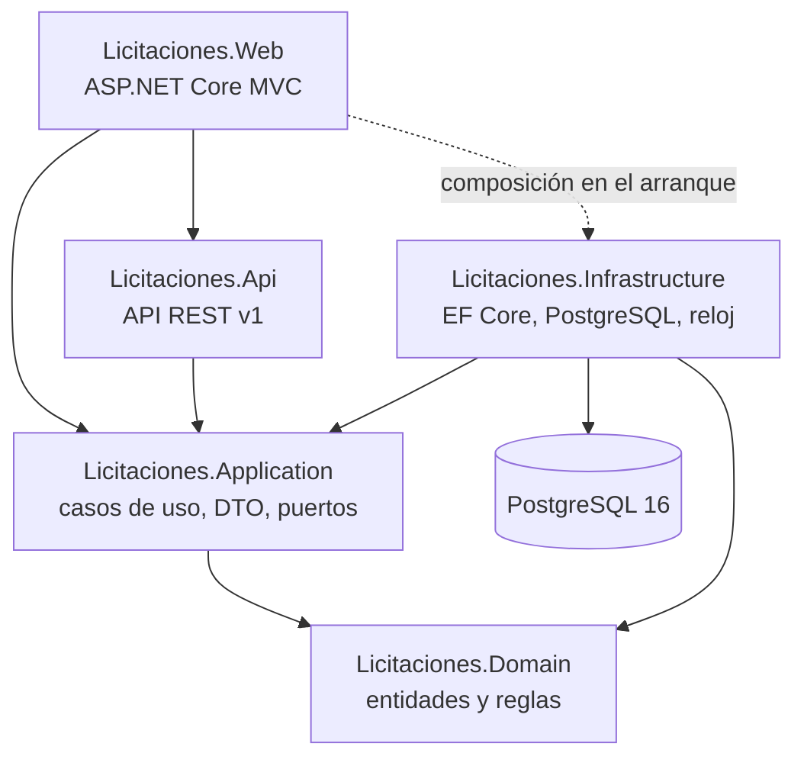
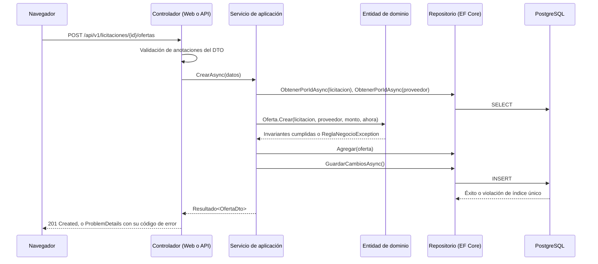

# Arquitectura general

## 1. Qué se construyó

Un **monolito modular** organizado en capas. Todo el sistema se despliega como un único contenedor
que sirve a la vez la interfaz web MVC y la API REST, y que habla con una sola base de datos
PostgreSQL. Los módulos (licitaciones, proveedores, ofertas, niveles de aprobación y tipo de cambio)
son fronteras dentro del código, no procesos separados.

La decisión responde al tamaño del problema. Separar en servicios independientes habría añadido
transacciones distribuidas, consistencia eventual y despliegues coordinados a un sistema que cabe en
una sola base de datos y que necesita, precisamente, transacciones fuertes: una oferta no puede
guardarse sin comprobar el presupuesto de su licitación en el mismo instante.

## 2. Capas y dirección de las dependencias

La flecha que importa es la que **no** existe: el dominio no conoce a nadie. `Licitaciones.Domain`
no referencia ningún paquete externo, ni siquiera Entity Framework Core. Las reglas del enunciado
—transiciones de estado, cierre funcional, unicidad normalizada, clasificación del ahorro— viven
ahí y se prueban sin base de datos, sin red y sin reloj real.

| Proyecto | Responsabilidad | Depende de |
| ----- | ----- | ----- |
| `Licitaciones.Domain` | Entidades, invariantes, servicios de dominio, normalización de texto. | Nada. |
| `Licitaciones.Application` | Casos de uso, DTO, resultados, puertos (interfaces de repositorio y unidad de trabajo). | Domain. |
| `Licitaciones.Infrastructure` | Adaptadores: EF Core sobre PostgreSQL, repositorios, unidad de trabajo, reloj del sistema. | Application, Domain. |
| `Licitaciones.Api` | Controladores REST, ProblemDetails, versionado, OpenAPI. Biblioteca ASP.NET Core. | Application. |
| `Licitaciones.Web` | Interfaz MVC, vistas Razor, filtros, composición de todas las capas. | Api, Application, Infrastructure. |

### Por qué la API es una biblioteca y no un ejecutable aparte

`Licitaciones.Api` se compila como biblioteca con `FrameworkReference` a `Microsoft.AspNetCore.App`
y se monta en el host web con `AddApplicationPart`. El resultado es un solo proceso, una sola imagen
y un solo conjunto de manifiestos de Kubernetes, con la interfaz en `/` y la API en `/api/v1`.

Mantenerlos como dos ejecutables habría duplicado configuración, sondas de salud, migraciones y
despliegue sin ganar nada: ambos consumen exactamente los mismos casos de uso.

## 3. Flujo de una petición

Tres detalles del diagrama merecen explicación.

**La validación ocurre tres veces, a propósito.** Las anotaciones del DTO atajan lo evidente antes de
tocar la base de datos; el dominio comprueba la invariante real (`monto <= presupuesto`) porque es la
única capa que no se puede saltar; y PostgreSQL tiene el índice único y la restricción CHECK como
última línea de defensa ante dos peticiones simultáneas que pasen la comprobación previa a la vez.

**Los errores esperados no son excepciones.** Los casos de uso devuelven `Resultado<T>` con un
`ErrorApp` que lleva código estable, mensaje seguro y campo asociado. La capa de presentación decide
si eso se convierte en un `422` con ProblemDetails o en un mensaje junto al campo del formulario. Las
excepciones quedan para lo que de verdad es excepcional.

**El dominio nunca conoce el ORM.** `UnidadDeTrabajo` traduce los errores de Npgsql
(`23505`, `23503`, `23514`) a excepciones propias de la aplicación, que `ProtectorCasoUso` convierte
en resultados. Ni el dominio ni los casos de uso mencionan PostgreSQL.

## 4. Decisiones de diseño y su motivo

### 4.1 Reloj inyectable

`IReloj` se inyecta en todas partes. Ninguna clase llama a `DateTimeOffset.UtcNow`.

Sin esto, la regla del cierre funcional (una licitación cuya fecha de cierre ya pasó no admite
ofertas, aunque su estado siga diciendo «Publicada») solo podría probarse esperando en tiempo real o
manipulando el reloj de la máquina. Con `RelojFalso` la prueba adelanta el tiempo y comprueba el
comportamiento en milisegundos, de forma determinista.

### 4.2 Colones como fuente de verdad

Todos los montos se guardan y se comparan en colones, en columnas `numeric(18,2)`. Los dólares son
una **representación calculada** que nunca se almacena: `Monto USD = Monto CRC ÷ tipo de cambio`.

La interfaz emite las dos representaciones desde el servidor y el JavaScript solo decide cuál se
muestra. Si el navegador recalculara la conversión, el redondeo del cliente podría diferir del de la
API y el mismo monto se vería distinto según dónde se mirara.

`float` y `double` están prohibidos para dinero, en el enunciado y en este diseño: representan `0,1`
de forma aproximada y una suma de mil montos acumula un error visible. `decimal` en .NET y `numeric`
en PostgreSQL son decimales exactos.

### 4.3 Normalización del texto como regla de dominio

`NormalizadorTexto.NormalizarNombre` recorta, colapsa espacios repetidos, aplica normalización
Unicode y pasa a mayúsculas invariantes. El resultado se **persiste** en una columna aparte
(`nombre_normalizado`, `codigo_normalizado`) respaldada por un índice único parcial.

Guardar el valor normalizado, en vez de normalizar dentro de la consulta, permite que el índice sea
utilizable: una comparación con función aplicada al lado izquierdo obligaría a recorrer la tabla
completa. Y al ser un índice de base de datos, la unicidad se cumple aunque dos peticiones lleguen a
la vez.

### 4.4 Aprobador desde una tabla, nunca desde una cadena de condicionales

`SelectorNivelAprobacion` recorre los niveles almacenados y devuelve el primero cuyo rango cubre el
monto. Cambiar los umbrales es editar filas, no recompilar. El servicio además valida que los rangos
no se traslapen y que solo uno quede abierto por arriba, porque un traslape haría que el aprobador
dependiera del orden de lectura.

### 4.5 Concurrencia optimista con una columna de versión

Cada entidad lleva `version`, un entero que `RegistrarActualizacion` incrementa. El formulario y el
cuerpo de la petición devuelven la versión que la persona tenía a la vista, y
`IUnidadDeTrabajo.EstablecerVersionOriginal` la fija antes de guardar.

Sin ese paso, la comparación usaría la versión leída milisegundos antes de escribir y solo detectaría
choques simultáneos. Con él se detecta el caso real: dos personas abren el mismo formulario y la
segunda guarda encima de cambios que nunca vio.

Se prefirió una columna explícita sobre `xmin` porque `xmin` es una columna de sistema que no se
puede exponer en un DTO ni enviar en un formulario sin trucos, y porque una migración que la declare
como columna real es rechazada por PostgreSQL.

### 4.6 Borrado lógico donde hay evidencia

Proveedores y licitaciones se dan de baja con `deleted_at`; las ofertas se conservan siempre. Un
proceso de licitación es un expediente: borrar el proveedor que ofertó destruiría la trazabilidad de
por qué se adjudicó lo que se adjudicó.

Los índices únicos de unicidad son **parciales** (`WHERE deleted_at IS NULL`), de modo que dar de
baja un proveedor libera su nombre para uno nuevo sin permitir dos vigentes con el mismo nombre.

### 4.7 Zona horaria

Todo se guarda y se compara en UTC (`timestamptz`). La presentación convierte a `America/Costa_Rica`
y los formularios interpretan lo que la persona escribe como hora de Costa Rica.

El identificador IANA no existe en Windows anterior a .NET 8 con ICU, así que
`ZonaHorariaCostaRica` intenta primero `America/Costa_Rica` y cae a
`Central America Standard Time`. Así las pruebas y el desarrollo funcionan en Windows y el
contenedor Linux usa el identificador correcto.

## 5. Dependencias externas y su justificación

| Paquete | Para qué | Por qué este |
| ----- | ----- | ----- |
| `Npgsql.EntityFrameworkCore.PostgreSQL` | Proveedor de EF Core para PostgreSQL. | Es el proveedor oficial y el único que expone índices parciales, `ILIKE` y tipos nativos. |
| `Asp.Versioning.Mvc` | Versionado de la API por segmento de ruta. | Es la evolución oficial de `Microsoft.AspNetCore.Mvc.Versioning`. |
| `Swashbuckle.AspNetCore` | Documento OpenAPI y consola interactiva. | Integra los comentarios XML del código, de modo que el contrato publicado no puede divergir de la documentación del código. |
| `xunit` | Marco de pruebas. | Un objeto de prueba por caso, lo que evita estado compartido entre pruebas. |
| `Testcontainers.PostgreSql` | PostgreSQL real y descartable en las pruebas. | Permite cumplir la prohibición de sustituir el motor por SQLite. |
| `Microsoft.Playwright` | Pruebas de navegador. | Espera automáticamente a que los elementos estén listos, lo que elimina la mayoría de las esperas fijas. |

Las versiones se fijan en un único lugar (`Directory.Packages.props`) con gestión centralizada de
paquetes, y las propiedades comunes en `Directory.Build.props`. Ningún proyecto declara versiones por
su cuenta: no puede haber dos versiones del mismo paquete en la solución.

## 6. Configuración y secretos

La cadena de conexión se lee de `ConnectionStrings:Licitaciones`. En `appsettings.json` está **vacía
a propósito**: el valor real llega siempre por la variable de entorno
`ConnectionStrings__Licitaciones`, que Docker Compose compone desde un `.env` no versionado y que
Kubernetes compone en el pod desde un ConfigMap y un Secret.

`ResolverCadenaConexion` lanza si no hay ninguna configurada. Es preferible que la aplicación no
arranque a que arranque apuntando a un lugar equivocado.

## 7. Documentos relacionados

- [modelo-datos.md](modelo-datos.md): el esquema físico, sus restricciones e índices.
- [integracion-modulos.md](integracion-modulos.md): cómo cooperan los módulos entre sí.
- [modulos/persistencia.md](modulos/persistencia.md): detalles de EF Core, migraciones y concurrencia.
- [docker.md](docker.md) y [kubernetes.md](kubernetes.md): cómo se despliega todo esto.
