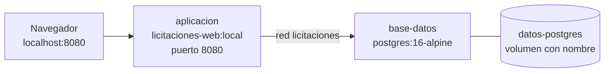

# Docker y Docker Compose

## 1. Puesta en marcha

```bash
cp .env.example .env
# Edite POSTGRES_PASSWORD antes de continuar
docker compose up --build
```

Cuando termine:

| Recurso | Dirección |
| ----- | ----- |
| Interfaz web | <http://localhost:8080> |
| Documentación de la API | <http://localhost:8080/swagger> |
| Sonda de vitalidad | <http://localhost:8080/salud/vivo> |
| Sonda de preparación | <http://localhost:8080/salud/listo> |

La base de datos queda migrada y con datos semilla: los tres estados de licitación, los tres niveles
de aprobación del enunciado y un tipo de cambio activo de 520,0000 CRC por USD. El sistema es
utilizable desde el primer arranque y **no necesita acceso a Internet**.

## 2. La imagen

`Dockerfile` construye en tres etapas.

| Etapa | Base | Qué hace |
| ----- | ----- | ----- |
| `restauracion` | `mcr.microsoft.com/dotnet/sdk:9.0` | Copia solo los archivos de proyecto y restaura paquetes. |
| `publicacion` | la anterior | Copia el código y publica en Release. |
| `ejecucion` | `mcr.microsoft.com/dotnet/aspnet:9.0` | Recibe únicamente los archivos publicados. |

Dos decisiones explican la forma:

**Los archivos de proyecto se copian antes que el código.** Mientras no cambien las dependencias,
Docker reutiliza la capa de restauración aunque cambie cada línea del código. Copiar todo de una vez
obligaría a descargar los paquetes en cada compilación.

**El SDK no llega a la imagen final.** La etapa de ejecución parte de la imagen de tiempo de
ejecución y solo recibe lo publicado. La diferencia de tamaño es de cientos de megabytes, y el SDK
en producción es superficie de ataque sin utilidad.

### Usuario sin privilegios

```dockerfile
USER $APP_UID
```

`APP_UID` lo define la imagen base de .NET y corresponde a un usuario sin privilegios (UID 1654). La
aplicación escucha en el puerto **8080**, no privilegiado, así que no necesita ninguna capacidad
especial. La integración continua comprueba explícitamente que la imagen no quede configurada para
correr como `root`.

### Comprobación de salud

```dockerfile
HEALTHCHECK --interval=15s --timeout=5s --start-period=40s --retries=5 \
    CMD curl --fail --silent --show-error http://localhost:8080/salud/listo || exit 1
```

`curl` se instala en la etapa de ejecución solo para esto: las imágenes de .NET no traen herramientas
de red. `start-period` de 40 segundos cubre el arranque y las migraciones, de modo que el
contenedor no se marca como enfermo mientras todavía está preparándose.

### Contexto de compilación

`.dockerignore` deja fuera `bin/`, `obj/`, `tests/`, `docs/`, `k8s/`, `.git/`, los `appsettings` de
desarrollo y el archivo `.env`. Además de acelerar la compilación, evita que un secreto local entre
por accidente en una capa de la imagen.

## 3. Los servicios



### `base-datos`

`postgres:16-alpine`, con credenciales tomadas del archivo `.env`. Su comprobación de salud usa
`pg_isready`.

### `aplicacion`

Se construye desde el `Dockerfile` del repositorio y **depende de la salud** de la base de datos:

```yaml
depends_on:
  base-datos:
    condition: service_healthy
```

Sin esa condición, la aplicación arrancaría mientras PostgreSQL todavía está inicializando y el
primer `docker compose up` fallaría en las migraciones. `depends_on` a secas solo garantiza el orden
de arranque, no que el servicio esté listo.

## 4. Configuración y secretos

Ninguna credencial está en el repositorio. `.env` es la única fuente y está excluido en
`.gitignore`; `.env.example` es la plantilla.

| Variable | Para qué |
| ----- | ----- |
| `POSTGRES_DB` | Nombre de la base de datos. |
| `POSTGRES_USER` | Usuario del motor. |
| `POSTGRES_PASSWORD` | Contraseña. **Obligatoria**: Compose falla si no está definida. |
| `PUERTO_APLICACION` | Puerto del equipo anfitrión (8080 por omisión). |

La cadena de conexión se compone en `docker-compose.yml` y llega a la aplicación como
`ConnectionStrings__Licitaciones`. En `appsettings.json` esa clave está vacía a propósito: si alguien
ejecuta la aplicación sin configurar el entorno, no arranca en lugar de apuntar a un sitio
equivocado.

## 5. Persistencia de los datos

El volumen con nombre `licitaciones-datos-postgres` guarda el directorio de datos del motor.
Comprobación:

```bash
# 1. Crear un proveedor
curl -X POST http://localhost:8080/api/v1/proveedores \
  -H 'Content-Type: application/json' \
  -d '{"nombre":"Constructora Alfa"}'

# 2. Detener y volver a levantar
docker compose down
docker compose up -d

# 3. El proveedor sigue ahí
curl "http://localhost:8080/api/v1/proveedores?Buscar=alfa"
```

`docker compose down` elimina los contenedores pero **no** el volumen. Este mismo recorrido lo
ejecuta la integración continua en cada cambio, de modo que la persistencia no se puede romper sin
que alguien se entere.

Para empezar de cero, incluidos los datos:

```bash
docker compose down --volumes
```

## 6. Operación

```bash
# Registros
docker compose logs --follow aplicacion
docker compose logs --follow base-datos

# Estado de salud de cada servicio
docker compose ps

# Consola de PostgreSQL
docker compose exec base-datos psql --username licitaciones --dbname licitaciones

# Reconstruir solo la aplicación tras un cambio de código
docker compose up --build --detach aplicacion
```

## 7. Problemas frecuentes

| Síntoma | Causa | Solución |
| ----- | ----- | ----- |
| `POSTGRES_PASSWORD` no definida | Falta el archivo `.env`. | `cp .env.example .env` y edite la contraseña. |
| El puerto 8080 está ocupado | Otro proceso lo usa. | Cambie `PUERTO_APLICACION` en `.env`. |
| La aplicación queda «unhealthy» | La base de datos aún no responde o la cadena de conexión es incorrecta. | `docker compose logs aplicacion`; revise las variables del servicio. |
| Los datos desaparecieron | Se ejecutó `docker compose down --volumes`. | Es el comportamiento esperado de esa opción. |
| Cambios de código que no se ven | La imagen no se reconstruyó. | `docker compose up --build`. |

## 8. Relación con Kubernetes

Docker Compose y los manifiestos de `k8s/` describen el mismo sistema con distinto alcance: Compose
sirve para desarrollo y demostración en un equipo; Kubernetes, para un clúster con réplicas, sondas
diferenciadas y almacenamiento gestionado. La imagen es exactamente la misma. Ver
[kubernetes.md](kubernetes.md).
