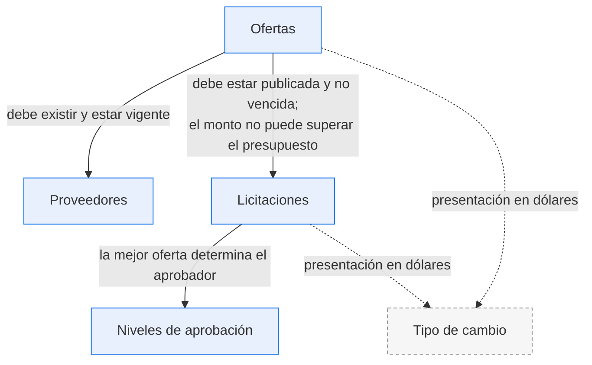
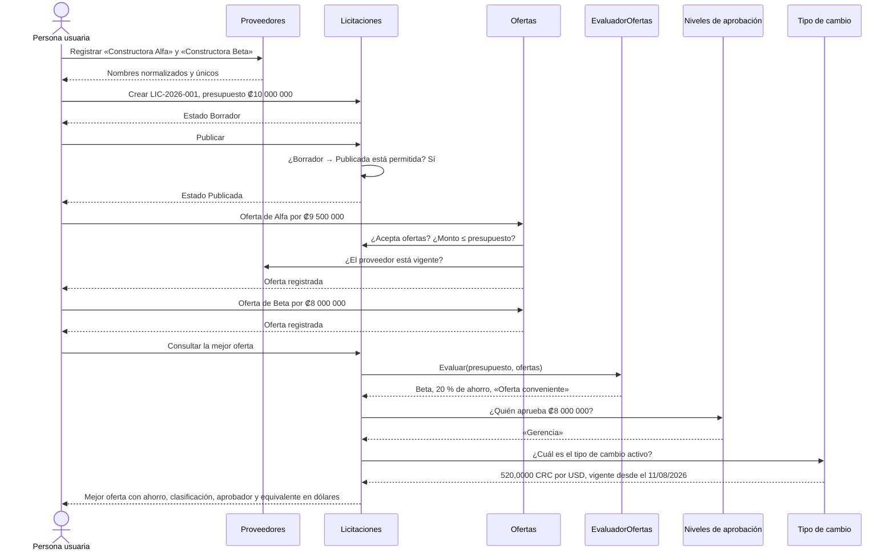

# Integración entre módulos

Los cinco módulos no son piezas sueltas: cada uno resuelve una parte y depende de las demás en
puntos concretos. Este documento describe dónde se tocan y por qué.

## 1. Mapa de dependencias



Las flechas continuas son dependencias de **regla de negocio**: si no se cumplen, la operación se
rechaza. Las punteadas son de **presentación**: si el tipo de cambio no está configurado, el sistema
sigue funcionando y simplemente muestra los montos solo en colones.

Esa diferencia es deliberada. Ninguna regla de negocio depende del tipo de cambio, porque el colón es
la fuente de verdad. Un sistema que no pudiera registrar ofertas por falta de tipo de cambio estaría
mal diseñado.

## 2. Puntos de integración, uno por uno

### 2.1 Ofertas → Proveedores

**Qué exige:** el proveedor debe existir y no estar dado de baja.

**Dónde:** `ServicioOfertas.CrearAsync` consulta el repositorio de proveedores antes de construir la
oferta; `Oferta.Crear` recibe la entidad ya validada.

**Qué pasa al eliminar un proveedor con ofertas:** el borrado es **lógico**. Las ofertas se
conservan intactas y la licitación sigue mostrando quién ofertó. La clave foránea está declarada
como `RESTRICT`, de modo que un borrado físico sería rechazado por PostgreSQL y traducido a un
mensaje controlado.

La razón es de negocio, no técnica: un expediente de licitación debe poder explicar por qué se
adjudicó lo que se adjudicó, y eso incluye a los proveedores que ya no operan.

### 2.2 Ofertas → Licitaciones

Es el punto de integración con más reglas.

| Regla | Dónde vive | Qué ocurre si no se cumple |
| ----- | ----- | ----- |
| La licitación debe estar en estado `Publicada`. | `Licitacion.GarantizarQueAceptaOfertas` | `422`, `OFERTA_LICITACION_NO_PUBLICADA` |
| La fecha de cierre no debe haber pasado. | El mismo método, comparando contra `IReloj.Ahora` | `422`, `OFERTA_VENCIDA` |
| El monto no puede superar el presupuesto; igualarlo sí es válido. | `Oferta.Crear` | `422`, `OFERTA_SUPERA_PRESUPUESTO` |
| Un proveedor solo puede tener una oferta por licitación. | Caso de uso más índice único compuesto | `409`, `OFERTA_DUPLICADA` |

**La integración en sentido inverso también existe.** Al editar una licitación, el nuevo presupuesto
no puede quedar por debajo de la oferta más alta ya registrada: bajarlo invalidaría retroactivamente
una oferta que se aceptó siguiendo las reglas. `ServicioLicitaciones.ActualizarAsync` consulta
`ObtenerMontoOfertaMayorAsync` y se lo pasa a `Licitacion.ActualizarDatos`.

Que el dominio reciba ese monto como parámetro, en lugar de consultarlo por su cuenta, es lo que
mantiene a `Licitacion` sin dependencias de infraestructura.

### 2.3 Licitaciones → Niveles de aprobación

**Qué exige:** al consultar la mejor oferta, el sistema determina qué instancia debe aprobar la
adjudicación según el monto.

**Cómo:** `EvaluadorOfertas` calcula la mejor oferta, el ahorro y la clasificación;
`ServicioLicitaciones` pide el aprobador a `IServicioNivelesAprobacion.ObtenerAprobadorAsync` con el
monto de esa mejor oferta.

**El aprobador no se guarda en la licitación.** Se calcula al consultar. Si se hubiera guardado, un
cambio en la tabla de niveles dejaría los expedientes existentes mostrando un nivel que ya no rige, y
nadie sabría cuál de los dos es el correcto.

**Si ningún rango cubre el monto**, el aprobador es `null` y la interfaz muestra «Sin nivel de
aprobación configurado». No es un error: es un estado legítimo de un sistema al que todavía no le
han terminado de configurar la parametrización.

### 2.4 Todo → Tipo de cambio

**Qué aporta:** la representación en dólares de cualquier monto.

**Cómo llega a la interfaz:** `FiltroTipoCambioActivo` es un filtro de acción global que consulta una
sola vez por petición el tipo de cambio activo y lo deja en `ViewData`. El ayudante `Html.Monto`
emite las dos representaciones en el HTML:

```html
<span class="monto">
  <span class="monto-crc">₡8 000 000,00</span>
  <span class="monto-usd d-none">US$ 15 384,62</span>
</span>
```

El JavaScript de la página solo alterna qué `span` está visible. **No calcula nada.** Si el navegador
recalculara la conversión, su redondeo podría diferir del de la API y el mismo monto se vería
distinto según dónde se mirara.

**Si no hay tipo de cambio activo**, la barra superior lo advierte con un enlace para registrar uno y
los montos se muestran solo en colones. Ninguna operación se bloquea.

## 3. Recorrido completo



Este recorrido es exactamente el que ejecuta la prueba de navegador
`FlujoCompleto_LlevaDeLaLicitacionEnBorradorHastaLaMejorOferta` y el que reproduce la colección de
solicitudes de [assets/coleccion-api.http](assets/coleccion-api.http).

## 4. Cómo se mantienen desacoplados

Los módulos se comunican por **interfaces de la capa de aplicación**, nunca por acceso directo a los
datos de otro módulo.

| Mecanismo | Qué evita |
| ----- | ----- |
| Cada servicio depende de `IServicio*`, no de implementaciones. | Que un módulo conozca los detalles internos de otro. |
| Cada repositorio devuelve entidades de su propio agregado. | Que un módulo consulte por su cuenta las tablas de otro. |
| Los conteos y montos agregados se piden con métodos explícitos (`ContarOfertasAsync`, `ObtenerMontoOfertaMayorAsync`). | Cargar colecciones completas en memoria para responder una pregunta que la base de datos contesta con un `COUNT` o un `MAX`. |
| Todo se confirma con una única `IUnidadDeTrabajo`. | Confirmaciones parciales cuando una operación toca varios registros. |

## 5. Operaciones que abarcan varios registros

Dos casos exigen transacción explícita:

**Activar un tipo de cambio.** Hay que desactivar el anterior y activar el nuevo. El índice único
parcial `ux_tipos_cambio_activo` rechazaría un instante con dos filas activas, así que la
desactivación se confirma dentro de la misma transacción antes de la activación. Está documentado en
el propio código y verificado por `PersistenciaTiposCambioTests`.

**Registrar una oferta.** Aunque solo inserta una fila, la validación lee la licitación y el
proveedor. La unidad de trabajo garantiza que la lectura y la escritura ocurran en la misma unidad
lógica, y el índice único cubre el caso de dos peticiones que pasen la validación a la vez.

## 6. Documentos de cada módulo

- [modulos/licitaciones.md](modulos/licitaciones.md)
- [modulos/proveedores.md](modulos/proveedores.md)
- [modulos/ofertas.md](modulos/ofertas.md)
- [modulos/niveles-aprobacion.md](modulos/niveles-aprobacion.md)
- [modulos/tipo-cambio.md](modulos/tipo-cambio.md)
- [modulos/interfaz-web.md](modulos/interfaz-web.md)
- [modulos/api-rest.md](modulos/api-rest.md)
- [modulos/persistencia.md](modulos/persistencia.md)

---

[← Volver al índice de documentación](README.md)
