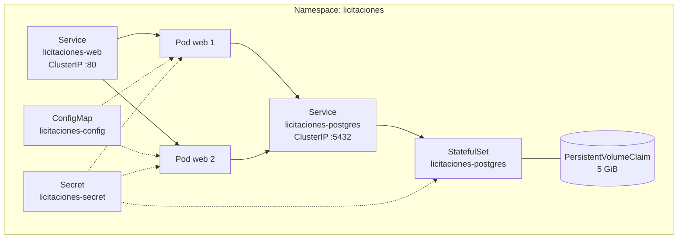

# Despliegue en Kubernetes

## 1. Manifiestos

Todos en `k8s/`, sin herramientas adicionales: son YAML que `kubectl apply` entiende tal cual.

| Archivo | Recurso | Para qué |
| ----- | ----- | ----- |
| `namespace.yaml` | Namespace `licitaciones` | Aísla el sistema del resto del clúster. |
| `app-configmap.yaml` | ConfigMap | Configuración no sensible: entorno, puerto, zona horaria y datos de conexión que no son secretos. |
| `app-secret.example.yaml` | Secret (plantilla) | Usuario, contraseña y nombre de la base de datos. **Es una plantilla**: el archivo con valores reales no se versiona. |
| `postgres-pvc.yaml` | PersistentVolumeClaim | Almacenamiento del motor, 5 GiB. |
| `postgres-statefulset.yaml` | StatefulSet | PostgreSQL 16, una réplica. |
| `postgres-service.yaml` | Service ClusterIP | Punto de acceso interno al motor. |
| `app-deployment.yaml` | Deployment | Aplicación web y API, dos réplicas. |
| `app-service.yaml` | Service ClusterIP | Punto de acceso a la aplicación. |

## 2. Orden de aplicación

```bash
kubectl apply -f k8s/namespace.yaml

# El Secret nunca se versiona con valores reales.
kubectl create secret generic licitaciones-secret \
  --namespace licitaciones \
  --from-literal=POSTGRES_USER=licitaciones \
  --from-literal=POSTGRES_PASSWORD='...' \
  --from-literal=POSTGRES_DB=licitaciones

kubectl apply -f k8s/app-configmap.yaml
kubectl apply -f k8s/postgres-pvc.yaml
kubectl apply -f k8s/postgres-statefulset.yaml
kubectl apply -f k8s/postgres-service.yaml
kubectl apply -f k8s/app-deployment.yaml
kubectl apply -f k8s/app-service.yaml
```

Comprobación y acceso:

```bash
kubectl get pods --namespace licitaciones --watch
kubectl port-forward --namespace licitaciones service/licitaciones-web 8080:80
# http://localhost:8080
```

La imagen debe estar disponible para el clúster. En minikube:

```bash
eval $(minikube docker-env)
docker build --tag licitaciones-web:1.0.0 .
```

En kind:

```bash
docker build --tag licitaciones-web:1.0.0 .
kind load docker-image licitaciones-web:1.0.0
```

## 3. Topología



## 4. Las tres sondas y por qué son distintas

| Sonda | Ruta | Qué comprueba | Consecuencia de fallar |
| ----- | ----- | ----- | ----- |
| `startupProbe` | `/salud/vivo` | Que el proceso ya responde. Hasta 150 s (30 intentos cada 5 s). | Se reinicia el contenedor. |
| `readinessProbe` | `/salud/listo` | Que además la base de datos responde. | El pod deja de recibir tráfico, pero **no** se reinicia. |
| `livenessProbe` | `/salud/vivo` | Solo el proceso. | Se reinicia el contenedor. |

La diferencia entre las dos últimas es la decisión de diseño importante.

Si la sonda de vitalidad comprobara la base de datos, una caída de PostgreSQL reiniciaría en bucle
**todos** los pods de la aplicación. Reiniciar un proceso sano no arregla una base de datos caída:
solo añade indisponibilidad y ruido en los registros justo cuando alguien intenta diagnosticar. Con
la separación actual, una caída del motor deja los pods vivos y fuera de rotación, y en cuanto
PostgreSQL vuelve, la sonda de preparación los reincorpora sin que nadie intervenga.

La sonda de arranque existe para que las migraciones no provoquen reinicios. Mientras no pase, las
otras dos ni siquiera se evalúan.

## 5. Migraciones

Las aplica la propia aplicación al arrancar, gobernado por
`BaseDatos__AplicarMigracionesAlIniciar` en el ConfigMap.

Con dos réplicas, dos pods podrían intentar migrar a la vez. `InicializadorBaseDatos` toma antes un
bloqueo de aviso de PostgreSQL:

```csharp
SELECT pg_advisory_lock(728314905);
// ... aplicar migraciones pendientes ...
SELECT pg_advisory_unlock(728314905);
```

El segundo pod se queda esperando en el bloqueo, y cuando lo obtiene ya no encuentra migraciones
pendientes. El bloqueo se toma sobre una conexión propia, no sobre la del contexto, para que no
interfiera con las transacciones de la migración. Además, antes de nada, el inicializador reintenta
la conexión hasta diez veces: en un clúster el pod de la aplicación puede programarse antes de que
el motor termine de arrancar.

Alternativa para un entorno con más gobierno: poner
`BaseDatos__AplicarMigracionesAlIniciar` en `"false"` y ejecutar las migraciones como un Job previo
al despliegue. La aplicación ya soporta esa modalidad sin cambios de código.

## 6. Almacenamiento

El motor usa un `PersistentVolumeClaim` declarado aparte, en lugar de un `volumeClaimTemplate` del
StatefulSet. Con una sola réplica, esto hace que los datos sobrevivan incluso si el StatefulSet se
elimina y se vuelve a crear, porque el PVC es un objeto independiente de su ciclo de vida.

`PGDATA` apunta a un subdirectorio (`/var/lib/postgresql/data/pgdata`) porque la imagen oficial
exige que el directorio de datos esté vacío al inicializar, y el punto de montaje puede traer
metadatos del volumen.

Si se necesitara alta disponibilidad del motor, la ruta sería un operador de PostgreSQL con
replicación, no más réplicas de este StatefulSet: dos procesos escribiendo sobre el mismo volumen
corromperían los datos.

## 7. Seguridad de los contenedores

| Ajuste | Valor | Motivo |
| ----- | ----- | ----- |
| `runAsNonRoot` | `true` | Ningún contenedor corre como root. |
| `runAsUser` / `runAsGroup` | 1654 (aplicación), 999 (PostgreSQL) | UID sin privilegios de cada imagen base. |
| `allowPrivilegeEscalation` | `false` | Un proceso comprometido no puede ganar privilegios. |
| `capabilities.drop` | `["ALL"]` | Ninguna capacidad del núcleo es necesaria. |
| `readOnlyRootFilesystem` | `true` (aplicación) | El sistema de archivos no se puede modificar en ejecución. |
| `seccompProfile` | `RuntimeDefault` | Restringe las llamadas al sistema disponibles. |

Con el sistema de archivos de solo lectura, .NET necesita dos directorios con escritura, montados
como `emptyDir`: `/tmp` y el anillo de claves de protección de datos.

### Sobre el anillo de claves y la afinidad de sesión

El anillo de claves firma los tokens antifalsificación de los formularios MVC. Al ser local a cada
pod, un formulario generado por el pod A no se validaría en el pod B. El `Service` de la aplicación
usa por eso `sessionAffinity: ClientIP`, de modo que una misma persona vuelve siempre al mismo pod.

Es una solución proporcionada al alcance de este proyecto y tiene un límite conocido: si el pod se
reinicia, la persona debe recargar el formulario. Un despliegue con más carga debería compartir el
anillo de claves entre réplicas, guardándolo en un volumen compartido o en la propia base de datos.
La API REST no depende de esta afinidad, porque no usa tokens antifalsificación.

## 8. Recursos

| Contenedor | Solicitud | Límite |
| ----- | ----- | ----- |
| Aplicación | 100 m CPU, 192 MiB | 500 m CPU, 512 MiB |
| PostgreSQL | 250 m CPU, 256 MiB | 1 CPU, 1 GiB |

Las solicitudes son lo que el planificador reserva; los límites, el techo. Declararlos evita que un
pod con una fuga consuma el nodo entero y permite que el planificador reparta con criterio.

## 9. Actualizaciones sin caída

```yaml
strategy:
  type: RollingUpdate
  rollingUpdate:
    maxSurge: 1
    maxUnavailable: 0
```

`maxUnavailable: 0` obliga a que el pod nuevo esté **listo** antes de retirar el viejo. Como la sonda
de preparación comprueba la base de datos, una versión que no logre conectarse nunca llega a recibir
tráfico y el despliegue se detiene con la versión anterior aún funcionando.

## 10. Validación de los manifiestos

La integración continua valida `k8s/` con `kubeconform` contra el esquema de Kubernetes 1.30 en modo
estricto, que rechaza campos desconocidos. Un error de tipografía en un nombre de propiedad se
detecta antes de llegar a un clúster.

```bash
kubeconform -strict -summary -kubernetes-version 1.30.0 k8s/
```

## 11. Diagnóstico

```bash
kubectl get all --namespace licitaciones
kubectl describe pod --namespace licitaciones --selector app.kubernetes.io/component=aplicacion
kubectl logs --namespace licitaciones --selector app.kubernetes.io/component=aplicacion --tail=100
kubectl logs --namespace licitaciones licitaciones-postgres-0

# Probar las sondas desde dentro del clúster
kubectl run diagnostico --namespace licitaciones --rm --stdin --tty \
  --image=curlimages/curl --restart=Never -- \
  curl --silent http://licitaciones-web/salud/listo
```

| Síntoma | Causa habitual |
| ----- | ----- |
| `CreateContainerConfigError` | Falta el Secret `licitaciones-secret`. |
| `ImagePullBackOff` | La imagen no está disponible para el clúster. |
| Pods `Running` pero no `Ready` | PostgreSQL no responde: la sonda de preparación los mantiene fuera de rotación, que es lo esperado. |
| `Pending` en el PVC | El clúster no tiene una StorageClass por omisión. |
