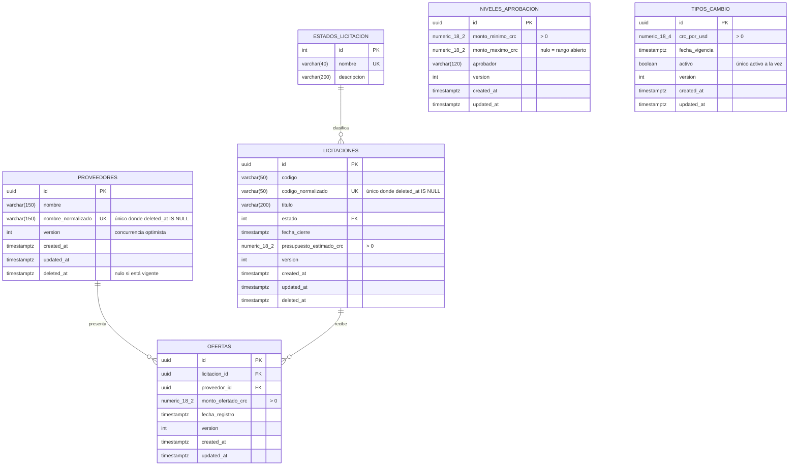

# Modelo de datos

Motor: **PostgreSQL 16**. Esquema `public`. Nombres de tablas y columnas en `snake_case`, en
español, sin abreviaturas. Todo el esquema lo crea la migración `EsquemaInicial`; no hay pasos
manuales.

## 1. Diagrama entidad-relación



`niveles_aprobacion` y `tipos_cambio` no tienen relación con las demás tablas: son parametrización
que se consulta por valor, no por referencia. El aprobador se resuelve comparando el monto de la
mejor oferta contra los rangos, y el tipo de cambio se aplica al presentar. Guardar el aprobador
dentro de la licitación la habría congelado: al cambiar la tabla, los expedientes existentes seguirían
mostrando el nivel viejo.

## 2. Tipos de dato y por qué

| Concepto | Tipo | Motivo |
| ----- | ----- | ----- |
| Identificadores | `uuid` generado por la aplicación | La entidad nace válida y completa antes de tocar la base de datos, lo que permite probar el dominio sin motor. |
| Dinero en colones | `numeric(18,2)` | Decimal exacto. `float`/`double` están prohibidos: aproximan `0,1` en binario y acumulan error. |
| Tipo de cambio | `numeric(18,4)` | Es un factor de conversión, no un monto; cuatro decimales evitan arrastrar error al dividir. |
| Fechas e instantes | `timestamptz` | Se guarda y compara en UTC; la presentación convierte a `America/Costa_Rica`. |
| Estado de licitación | `int` con clave foránea al catálogo | El catálogo documenta los valores dentro de la propia base de datos y la clave foránea impide un estado inventado. |
| Versión | `int` | Testigo de concurrencia optimista legible, que puede viajar en un DTO o en un campo oculto del formulario. |

## 3. Restricciones declaradas en el motor

Las reglas se validan en la interfaz, en el servidor **y** en PostgreSQL. Las dos primeras dan buenos
mensajes; la tercera es la que no se puede evadir.

### Índices únicos

| Índice | Tabla | Columnas | Filtro | Qué garantiza |
| ----- | ----- | ----- | ----- | ----- |
| `ux_proveedores_nombre_normalizado` | `proveedores` | `nombre_normalizado` | `deleted_at IS NULL` | No hay dos proveedores vigentes cuyo nombre difiera solo en mayúsculas, espacios repetidos o composición Unicode. |
| `ux_licitaciones_codigo_normalizado` | `licitaciones` | `codigo_normalizado` | `deleted_at IS NULL` | Lo mismo para el código de licitación. |
| `ux_ofertas_licitacion_proveedor` | `ofertas` | `licitacion_id, proveedor_id` | — | Un proveedor presenta una sola oferta por licitación. |
| `ux_tipos_cambio_activo` | `tipos_cambio` | `activo` | `activo` | Solo puede existir una fila activa. |
| `ux_niveles_aprobacion_monto_minimo` | `niveles_aprobacion` | `monto_minimo_crc` | — | Dos niveles no arrancan en el mismo monto. |
| `ux_estados_licitacion_nombre` | `estados_licitacion` | `nombre` | — | El catálogo no tiene nombres repetidos. |

El filtro parcial es lo que permite que el borrado lógico libere el nombre: una fila con
`deleted_at` no entra en el índice y por tanto no bloquea a la siguiente.

### Restricciones CHECK

| Restricción | Expresión | Regla del enunciado |
| ----- | ----- | ----- |
| `ck_licitaciones_presupuesto_positivo` | `presupuesto_estimado_crc > 0` | Los montos son estrictamente mayores que cero. |
| `ck_licitaciones_codigo_no_vacio` | `length(btrim(codigo)) > 0` | El código no puede ser solo espacios. |
| `ck_ofertas_monto_positivo` | `monto_ofertado_crc > 0` | El monto ofertado es mayor que cero. |
| `ck_proveedores_nombre_no_vacio` | `length(btrim(nombre)) > 0` | El nombre no puede ser solo espacios. |
| `ck_tipos_cambio_valor_positivo` | `crc_por_usd > 0` | Un tipo de cambio de cero haría imposible la división. |
| `ck_niveles_aprobacion_minimo_positivo` | `monto_minimo_crc > 0` | El rango arranca en un monto real. |
| `ck_niveles_aprobacion_rango_coherente` | `monto_maximo_crc IS NULL OR monto_maximo_crc >= monto_minimo_crc` | Un rango invertido no cubriría nada. |

La regla «la oferta no puede superar el presupuesto» **no** es un CHECK: involucra dos tablas y
PostgreSQL no admite subconsultas en `CHECK`. Vive en el dominio (`Oferta.Crear`) y se comprueba
también al editar el presupuesto de una licitación que ya tiene ofertas.

### Claves foráneas

| Clave | Desde | Hacia | Al borrar |
| ----- | ----- | ----- | ----- |
| `fk_ofertas_licitacion` | `ofertas.licitacion_id` | `licitaciones.id` | `RESTRICT` |
| `fk_ofertas_proveedor` | `ofertas.proveedor_id` | `proveedores.id` | `RESTRICT` |
| `fk_licitaciones_estado` | `licitaciones.estado` | `estados_licitacion.id` | `RESTRICT` |

`RESTRICT` y no `CASCADE`: borrar en cascada destruiría las ofertas, que son la evidencia del
proceso. Cuando alguien intenta eliminar un registro con dependencias, PostgreSQL devuelve `23503`,
`UnidadDeTrabajo` lo traduce a `ViolacionIntegridadException` y la aplicación muestra un mensaje
comprensible sin filtrar el nombre de la restricción ni la consulta.

### Índices de apoyo

| Índice | Para qué consulta |
| ----- | ----- |
| `ix_ofertas_licitacion_monto_fecha` | Mejor oferta: menor monto y, en empate, la registrada primero. Cubre el orden completo. |
| `ix_licitaciones_estado` | Filtro por estado en el listado. |
| `ix_licitaciones_fecha_cierre` | Detección de licitaciones vencidas y orden por cierre. |
| `ix_tipos_cambio_fecha_vigencia` | Historial de tipos de cambio ordenado por vigencia. |
| `IX_ofertas_proveedor_id` | Ofertas de un proveedor y conteo previo a darlo de baja. |

## 4. Datos semilla

La migración inicial deja el sistema utilizable desde el primer arranque, con identificadores fijos
para que reaplicar la migración sea idempotente.

**Estados de licitación**

| id | nombre | descripción |
| ----- | ----- | ----- |
| 0 | Borrador | En preparación; admite cambios y aún no recibe ofertas. |
| 1 | Publicada | Abierta a ofertas hasta la fecha de cierre. |
| 2 | Cerrada | No admite ofertas nuevas ni cambios. |

**Niveles de aprobación** (los del enunciado)

| Monto mínimo (CRC) | Monto máximo (CRC) | Aprobador |
| ----- | ----- | ----- |
| 0,01 | 999 999,99 | Encargado de área |
| 1 000 000,00 | 9 999 999,99 | Gerencia |
| 10 000 000,00 | *(abierto)* | Junta Directiva |

**Tipo de cambio inicial:** 520,0000 CRC por USD, activo.

Ese valor inicial es el que permite cumplir el requisito de operar **sin acceso a Internet**: el
sistema nunca consulta un servicio externo, el tipo de cambio se administra desde la propia interfaz
y siempre se muestra junto a su fecha de vigencia.

## 5. Migraciones

Una sola migración, `EsquemaInicial`, versionada en
`src/Licitaciones.Infrastructure/Persistencia/Migraciones/`. La tabla de historial se llama
`__ef_migraciones_historial`.

```bash
# Crear una migración nueva (requiere la variable de entorno con la cadena de conexión)
dotnet ef migrations add NombreDeLaMigracion \
  --project src/Licitaciones.Infrastructure \
  --startup-project src/Licitaciones.Web \
  --output-dir Persistencia/Migraciones

# Aplicarlas a mano
dotnet ef database update \
  --project src/Licitaciones.Infrastructure \
  --startup-project src/Licitaciones.Web
```

En ejecución las aplica `InicializadorBaseDatos` al arrancar, si
`BaseDatos:AplicarMigracionesAlIniciar` lo autoriza. Antes de migrar toma un bloqueo de aviso
(`pg_advisory_lock`), de modo que con varias réplicas solo una migra y las demás esperan a que
termine. Ver [kubernetes.md](kubernetes.md#migraciones).

## 6. Auditoría y concurrencia

Todas las tablas de negocio llevan `created_at`, `updated_at` y una columna `version`. Las que
admiten borrado lógico llevan además `deleted_at`.

`EntidadBase.RegistrarActualizacion` fija `updated_at` en UTC e incrementa `version`. El contexto
repite la marca en `SaveChanges` como red de seguridad, por si alguna modificación llegara por un
camino que no pase por los métodos de dominio.

La columna `version` está declarada como testigo de concurrencia (`IsConcurrencyToken`). Cuando la
versión que envía el cliente no coincide con la almacenada, EF Core lanza
`DbUpdateConcurrencyException`, que se traduce a un `409 Conflict` con el código
`CONFLICTO_CONCURRENCIA` y, en la web, a un mensaje que pide recargar el formulario.

## 7. Consultas destacadas

**Mejor oferta de una licitación.** Se ordena por monto ascendente y, en empate, por fecha de
registro; el desempate final es el identificador, para que el resultado sea estable aunque dos
ofertas compartan instante.

```sql
SELECT o.*
FROM ofertas o
WHERE o.licitacion_id = $1
ORDER BY o.monto_ofertado_crc ASC, o.fecha_registro ASC, o.id ASC
LIMIT 1;
```

**Búsqueda insensible a mayúsculas.** El repositorio usa `EF.Functions.ILike` sobre la columna
normalizada en lugar de aplicar `ToUpper()` en la consulta: una función sobre la columna impediría
usar el índice.

**Conteo de ofertas por lote.** Los listados necesitan el número de ofertas de cada fila. En vez de
una consulta por fila, los repositorios exponen `ContarOfertasAsync(IReadOnlyCollection<Guid>)`, que
resuelve la página completa con un solo `GROUP BY`.
