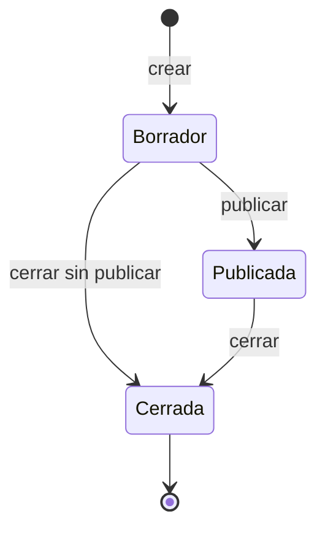

# Módulo: Licitaciones

Historias cubiertas: H-06, H-07, H-08. Código principal:
`src/Licitaciones.Domain/Entidades/Licitacion.cs`,
`src/Licitaciones.Domain/Servicios/TransicionesLicitacion.cs`,
`src/Licitaciones.Application/Servicios/ServicioLicitaciones.cs`.

## 1. Qué representa

Un proceso de compra con un código único, un título, una fecha de cierre y un presupuesto estimado en
colones. Nace en `Borrador`, se publica para recibir ofertas y termina `Cerrada`.

## 2. Máquina de estados



Solo esas tres transiciones existen. Todo lo demás —`Publicada → Borrador`, `Cerrada → Publicada`,
`Cerrada → Borrador` y cualquier transición a sí misma— se rechaza con
`LICITACION_TRANSICION_NO_PERMITIDA`.

La implementación no es una cadena de condicionales sino un conjunto de pares permitidos:

```csharp
private static readonly HashSet<(EstadoLicitacion Origen, EstadoLicitacion Destino)> Permitidas =
[
    (EstadoLicitacion.Borrador, EstadoLicitacion.Publicada),
    (EstadoLicitacion.Borrador, EstadoLicitacion.Cerrada),
    (EstadoLicitacion.Publicada, EstadoLicitacion.Cerrada),
];
```

Así la regla se lee de un vistazo, la prueba puede recorrer las nueve combinaciones posibles y
`DestinosDesde` alimenta directamente los botones de la interfaz: la vista muestra exactamente las
transiciones que el dominio permite, sin duplicar la lógica.

## 3. Cierre funcional

Una licitación cuya fecha de cierre ya pasó **no admite ofertas ni cambios**, aunque su campo de
estado siga diciendo `Publicada`.

```csharp
public bool EstaCerradaFuncionalmente(DateTimeOffset ahora) =>
    Estado == EstadoLicitacion.Cerrada || FechaCierre <= ahora;
```

Es una regla del enunciado y evita un problema real: nadie garantiza que exista un proceso que cierre
las licitaciones vencidas puntualmente. Si el sistema confiara solo en el campo de estado, una
licitación vencida seguiría aceptando ofertas hasta que alguien la cerrara a mano.

El instante «ahora» llega siempre desde `IReloj`, lo que permite verificar la regla adelantando el
reloj de la prueba en vez de esperar.

La interfaz avisa explícitamente de esta situación:

> La fecha de cierre ya se alcanzó, por lo que la licitación se considera **cerrada funcionalmente**
> aunque su estado siga indicando «Publicada».

## 4. Reglas de validación

| Campo | Regla | Código de error |
| ----- | ----- | ----- |
| `Codigo` | Obligatorio, máximo 50 caracteres. | `LICITACION_CODIGO_REQUERIDO`, `LICITACION_CODIGO_DEMASIADO_LARGO` |
| `Codigo` | Único tras normalizar (recorte, espacios colapsados, Unicode, mayúsculas). | `LICITACION_CODIGO_DUPLICADO` |
| `Titulo` | Obligatorio, máximo 200 caracteres. | `LICITACION_TITULO_REQUERIDO`, `LICITACION_TITULO_DEMASIADO_LARGO` |
| `FechaCierre` | Debe ser posterior al instante actual. | `LICITACION_FECHA_CIERRE_INVALIDA` |
| `PresupuestoEstimadoCrc` | Estrictamente mayor que cero. | `LICITACION_PRESUPUESTO_INVALIDO` |
| `PresupuestoEstimadoCrc` | Al editar, no puede quedar por debajo de la oferta más alta registrada. | `LICITACION_PRESUPUESTO_MENOR_A_OFERTA_EXISTENTE` |

La penúltima regla merece explicación. Si el presupuesto pudiera bajarse libremente, una oferta
aceptada ayer podría quedar hoy por encima del tope, sin que nadie la hubiera tocado. El caso de uso
consulta el monto de la oferta mayor y se lo pasa a la entidad, que decide.

## 5. Eliminación

Borrado **lógico** con `deleted_at`, que devuelve `204`. Tener ofertas **no** impide la baja: la
regla del enunciado es conservarlas como evidencia, no bloquear el expediente. La licitación
desaparece de los listados ordinarios y sus ofertas siguen consultables, porque son las que explican
por qué se adjudicó lo que se adjudicó.

Impedir la baja habría hecho inútil el borrado lógico justo en el caso para el que existe: una
licitación sin ofertas se puede borrar sin perder nada, y es la que sí tiene ofertas la que necesita
conservarse.

El índice único del código es parcial (`WHERE deleted_at IS NULL`), de modo que dar de baja una
licitación libera su código para otra nueva, sin permitir dos vigentes con el mismo.

La interfaz pide confirmación antes de eliminar, con el nombre del registro en el mensaje.

## 6. Detalle de una licitación

`GET /api/v1/licitaciones/{id}` devuelve un `LicitacionDetalleDto` con tres partes:

1. Los datos de la licitación, incluida la marca `cerradaFuncionalmente`.
2. La evaluación de ofertas: mejor oferta, ahorro, clasificación y aprobador.
3. Las transiciones permitidas desde el estado actual.

La tercera parte permite que cualquier cliente construya la interfaz correcta sin conocer la máquina
de estados.

## 7. Pruebas

| Prueba | Regla |
| ----- | ----- |
| `TransicionesLicitacionTests` | Las nueve combinaciones de origen y destino. |
| `LicitacionTests.Crear_ConFechaDeCierrePasada_Falla` | Fecha futura obligatoria. |
| `LicitacionTests.EstaCerradaFuncionalmente_*` | Cierre por vencimiento con reloj controlado. |
| `LicitacionTests.ActualizarDatos_ConPresupuestoMenorALaOfertaMayor_Falla` | Tope inferior del presupuesto. |
| `ServicioLicitacionesTests` | Duplicado de código, transiciones desde el caso de uso, borrado con ofertas. |
| `LicitacionesApiTests` | Códigos HTTP, ProblemDetails y transiciones desde la API. |
| `PersistenciaProveedoresTests` (índice análogo) y `EsquemaBaseDatosTests` | El índice único parcial del código existe en el motor con su filtro. |

---

[← Volver al índice de documentación](../README.md)
